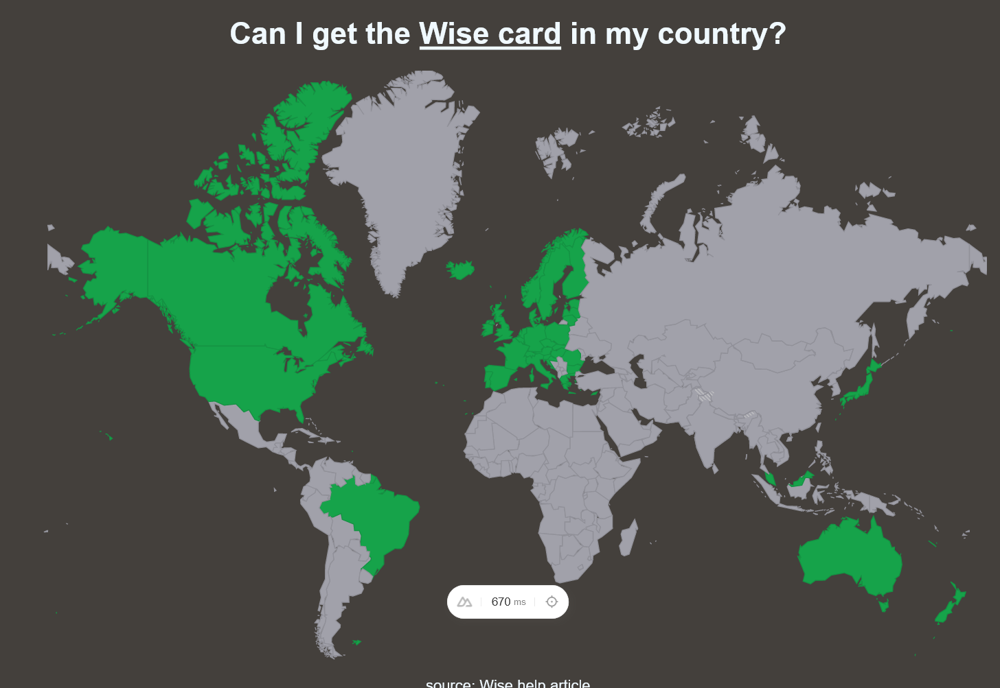

# Can I get the Wise card in my country? using [Google GeoMap](https://developers.google.com/chart/interactive/docs/gallery/geochart#methods) w/ [Nuxt 3](https://nuxt.com/docs/getting-started/introduction)

Look at the  to learn more.


## Tools
- [Vue 3](https://vuejs.org/)
- [Nuxt 3](https://nuxt.com/docs/getting-started/introduction)
- [Google GeoMap](https://developers.google.com/chart/interactive/docs/gallery/geochart#methods)
- [Vue-google-charts](https://github.com/devstark-com/vue-google-charts)
- [Vercel for Deployment](https://vercel.com)

## Recording Process
[Recording YouTube Process](https://www.youtube.com/playlist?list=PL_sapWkWdZHF3NuM3ZwvTx1NTgTQzPqtv)

## Setup

Make sure to install the dependencies:

```bash
# npm
npm install

# pnpm
pnpm install

# yarn
yarn install
```

## Development Server

Start the development server on `http://localhost:3000`:

```bash
# npm
npm run dev

# pnpm
pnpm run dev

# yarn
yarn dev
```

## Production

Build the application for production:

```bash
# npm
npm run build

# pnpm
pnpm run build

# yarn
yarn build
```

Locally preview production build:

```bash
# npm
npm run preview

# pnpm
pnpm run preview

# yarn
yarn preview
```

Check out the [deployment documentation](https://nuxt.com/docs/getting-started/deployment) for more information.
